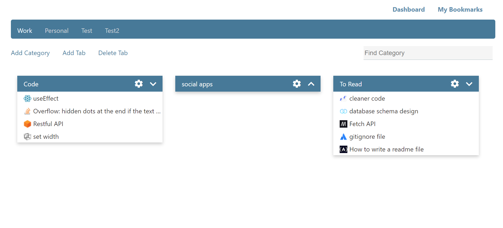

# Bookmarking application

# Description
The goal of the project is to keep the bookmarks organized. The user can save the bookmark in different tabs and different categories, which makes the task of dealing with a lot of bookmarks simple and comfortable.

## project functionalities
* create and delete tab.
* create a category in a specific tab, and delete it.
* create a bookmark in a specific category, and delete it.
* search for a category.
* search for a bookmark.

# technologies 

## front-end:
HTML, CCS, JS, React.

## back-end:
Nodejs server with Express, MongoDB.

# How to Run the Project
The project currently contains two parts that run on different servers, the front-end `http://localhost:3000` and the back-end `http://localhost:3012`, so the front end sends requests to the server by the fetch method.

1. cd to the backend folder and write`npm install` in the terminal .
2. cd to the frontend folder and write run the command `npm install`.
3. in the frontend folder run `npm start` which will run the app in your default browser.

# Extra points
I didn't add default data to the app so please don't be surprised when it looks empty.
You can start add tab then categories and bookmarks. You will figure that out. then the app will tack it shape :grin:
The app will look like this when you save your bookmarks:

